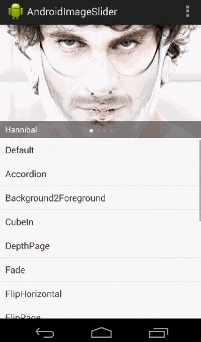

# Android---UI效果

#Github上的UI效果收集         

-1.Android屏幕适配方案，直接填写设计图上的像素尺寸即可完成适配，最大限度解决适配问题。           
项目地址:https://github.com/lyxwll/AndroidAutoLayout            

0.一个很酷的检测UI的工具，包括View的层级、边界、事件等，总之一副很屌的样子。
https://github.com/xfumihiro/ViewInspector                

1.GreenDroid最初是由Cyril Mottier发起，是一个Android的UI开发类库，能够让UI开发更加简便，并且在应用中始终保持一致.         
https://github.com/cyrilmottier/GreenDroid          

2.Aphid FlipView是一个能够实现Flipboard翻页效果的UI组件。              
https://github.com/openaphid/android-flip        

3.一个灵感来自Designer News, Dribbble & Product Hunt的material design效果.               
https://github.com/nickbutcher/plaid                
            

4.MaterialDesignLibrary:https://github.com/navasmdc/MaterialDesignLibrary               
在众多新晋库中，MaterialDesignLibrary可以说是颇受开发者瞩目的一个控件效果库，能够让开发者在Android 2.2系统上使用Android 5.0才支持的控件效果，比如扁平、矩形、浮动按钮，复选框以及各式各样的进度指示器等。MaterialDesignLibrary还拥有SnackBar、Dialog、Color selector组件，可非常便捷地对应用界面进行设置。                      
          

5.MaterialEditText:https://github.com/rengwuxian/MaterialEditText             
随着Material Design的到来，AppCompat v21也为开发者提供了Material Design的控件外观支持，其中就包括EditText，但却并不好用，没有设置颜色的API，也没有任何Google Material Design Spec中提到的特性。于是，来自国内的开发者“扔物线”开发了MaterialEditText库，直接继承EditText，无需修改Java文件即能实现自定义控件颜色。                               
           

6.Android-LollipopShowcase是由来自奥地利的移动、后端及Web开发者Mike Penz所开发的演示应用，集中演示了新Material Design中所有的UI效果，以及AndroidLollipop中其他非常酷炫的特性元素，比如Toolbar、RecyclerView、ActionBarDrawerToggle、Floating Action Button（FAB）、Android Compat Theme等。           
https://github.com/mikepenz/LollipopShowcase                 
        

7.Android-ObservableScrollView是一款用于在滚动视图中观测滚动事件的Android库。它能够轻而易举地与Android 5.0 Lollipop引进的工具栏（Toolbar）进行交互，还可以帮助开发者实现拥有Material Design应用视觉体验的界面外观，支持ListView、ScrollView、WebView、RecyclerView、GridView组件。     
https://github.com/ksoichiro/Android-ObservableScrollView                      

8.AndroidImageSlider:一个漂亮的Slider。         
https://github.com/daimajia/AndroidImageSlider            

9.AndroidViewAnimations:视图动画效果           
https://github.com/daimajia/AndroidViewAnimations                   

10.一款粘性菜单弹跳动画效果,灵感来自Material design.        
https://github.com/melvinjlobo/MetaballMenu            
      

**11.美化原生 Toast**
https://github.com/GrenderG/Toasty

------
###滑动引导界面     

**12.小红书视差动画引导界面**           
https://github.com/w446108264/XhsWelcomeAnim       
   

**13.Demo of the onboarding animations of Yahoo NewsApp,雅虎新闻App引导页动画.**
https://github.com/rahulrj/YahooNewsOnboarding               
        

**13.1.SpringIndicator,使用bezier实现粘连效果的页面指示**     
项目地址：https://github.com/chenupt/SpringIndicator            
      

**13.2差效果引导页Simple library that helps developers to create awesome sliding android app tutorial.**    
项目地址:https://github.com/Cleveroad/slidingtutorial-android               
   

**13.3自定义欢迎界面**         
https://github.com/stephentuso/welcome-android      

**13.4.带有色彩渐变的新功能引导页**        
https://github.com/codemybrainsout/ahoy-onboarding        

**13.5.Inspired by Heinrich Reimer Material Intro and developed with love from scratch**      
https://github.com/TangoAgency/material-intro-screen

-----

14.一个用于app指向性功能高亮的库.      
https://github.com/hongyangAndroid/Highlight           
   

15.一款标尺状选择的WheelView,可以选择日期,金钱等其他短的长度值.     
https://github.com/lantouzi/WheelView-Android        

16.一个Android专用的LogCat工具，主要功能为打印行号、函数调用、Json解析、点击跳转等。         
使用地址:http://blog.csdn.net/zhaokaiqiang1992/article/details/49837627        
项目地址:https://github.com/ZhaoKaiQiang/KLog                  

17.选择省份或者是城市模块，可以直接拿来用.         
https://github.com/ZhaoKaiQiang/SelectCityModule             

18.仿iOS的AlertViewController 几乎完美还原iOS的AlertViewController,同时支持Alert和ActionSheet模式，每一个细节都是精雕细琢，并把api封装成懒到极致模式，一行代码就可以进行弹窗.          
https://github.com/saiwu-bigkoo/Android-AlertView                 
    

19.仿手机QQ聊天列表滑动菜单删除和手势滑动返回的两种方式.       
https://github.com/finddreams/SlidingBack                     
   

20.Android消息数显示控件.       
项目地址:https://github.com/bingoogolapple/BGABadgeView-Android                                
   

21.高级的TextView特效.         
https://github.com/Rogero0o/MatchView                 
       

22.An android view,which can layer on any gravity for swiping.          
项目地址:https://github.com/aicaprio/CurtainView            

23.Side-Menu.Android,分类侧滑菜单，Yalantis 出品。               
项目地址：https://github.com/Yalantis/Side-Menu.Android              
        

24.Context-Menu.Android可以方便快速集成漂亮带有动画效果的上下文菜单，Yalantis出品。         
项目地址：https://github.com/Yalantis/Context-Menu.Android           
         

25.Titanic,可以显示水位上升下降的TextView             
项目地址：https://github.com/RomainPiel/Titanic              
     

26.Android Typeface Helper,可以帮你轻松实现自定义字体的库              
项目地址：https://github.com/norbsoft/android-typeface-helper         

27.ToggleButton,状态切换的 Button，类似 iOS，用 View 实现            
项目地址：https://github.com/zcweng/ToggleButton          
   

28.实现滑动ViewPager渐变背景色             
项目地址：https://github.com/TaurusXi/GuideBackgroundColorAnimation         
           

29.Euclid,用户简历界面，Yalantis 出品。             
项目地址：https://github.com/Yalantis/Euclid           
          

30.InstaMaterial,Instagram的一组Material 风格的概念设计.            
项目地址：https://github.com/frogermcs/InstaMaterial        
          

31.让你的 App 不再那么无聊和单调，气泡风格的过渡动画效果       
https://github.com/Cleveroad/BubbleAnimationLayout

32.FoldableLayout,折叠的信纸被打开一样的动画效果         
项目地址：https://github.com/alexvasilkov/FoldableLayout          
       

33.PersistentSearch,在点击搜索的时候控件在原有位置显示输入框。          
项目地址：https://github.com/Quinny898/PersistentSearch           
        

34.discrollview,当上下滚动的时候子元素会呈现不同动画效果的scrollView，网页上称之为：视差滚动.        
项目地址： https://github.com/flavienlaurent/discrollview           
         

35..sweet-alert-dialog,一个带动画效果的自定义对话框样式.            
项目地址：https://github.com/pedant/sweet-alert-dialog         
     

36.android-floating-action-button,Material Desig风格的浮动操作按钮.            
项目地址：https://github.com/futuresimple/android-floating-action-button      
       

---------
##自定义日历视图           
37.android-collapse-calendar-view,可以在月视图与周视图之间切换的calendar控件             
项目地址：https://github.com/blazsolar/android-collapse-calendar-view          
       

**37.1.CalendarPager:This is one horizontal calendar with viewPager.recyclerview横向滑动的日历.**
项目地址:https://github.com/lyxwll/CalendarPager                                   

    

**37.2.An android library which provides a compact calendar view much like the one used in google calenders.**      
https://github.com/SundeepK/CompactCalendarView       

**37.3.显示阳历，农历，节假日和二十四节气 实现对某月日期的单选或者多选的andorid 日历控件库。**       
https://github.com/myjoybar/android-calendar-view  

----------

**38.支持多个方向滑动的 View，类似 Calendar 里的 UI 效果**    
https://github.com/Kelin-Hong/ScrollablePanel

**39.**

40.一个简单的Android标签控件.https://github.com/H07000223/FlycoLabelView             
        

41.A simple way to "badge" any given Android view at runtime without having to cater for it in layout.           
项目地址:https://github.com/jgilfelt/android-viewbadger             
            

42.Interesting android title bar with immersive status bar and scroll animation like tumblr app (color of icon and text on title bar gradually change to end color).           
项目地址:https://github.com/markzhai/InterestingTitleBar              
           

------
##下拉列表选择      
43.安卓选择器类库，包括日期时间选择器、单项选择器、地址选择器、颜色选择器、文件目录选择器、数字选择器、星座选择器等。Picker for android, include date&time/option/color/file&directory/number.             
项目地址:https://github.com/gzu-liyujiang/AndroidPicker            

44.一个实用的多条件筛选菜单，在很多App上都能看到这个效果，如美团，爱奇艺电影票等.           
项目地址:https://github.com/dongjunkun/DropDownMenu               
               

45.DropDownMenu for Android,Filter the list based on multiple condition. http://fangjie.info             
项目地址:https://github.com/JayFang1993/DropDownMenu            
            

46.模仿大众点评的筛选框.             
项目地址:https://github.com/crazyhl/PopupButton               
            

47.Android-PickerView:仿iOS的PickerView控件，有时间选择和选项选择并支持一二三级联动效果.                        
项目地址:https://github.com/lyxwll/Android-PickerView                             

   

----------

48.SearchView:Yet another floating search view implementation, also known as persistent search.
项目地址:https://github.com/renaudcerrato/FloatingSearchView             
           

49.Android Tooltip.Create Toast like tooltips, physical targets can be specified, or even points on screen. Many additional features and customizations. Just look at the samples Activities.                     
项目地址:https://github.com/lyxwll/android-target-tooltip                 
                      

50.SlideSwitch is A widget likes switch, which works with ViewPager and two fragments. It is developed based on PagerSlidingTabStrip and supports gradient on text color.                               
项目地址:https://github.com/small-dream/SlideSwitch                           
 
     
51.ToolbatIndicator:模仿Twitter iOS 客户端顶部栏的指示器.                                          
项目地址:https://github.com/nekocode/ToolbarIndicator                    
                                    

53.一个自定义标签view，并具有可拖拽功能.An Android TagView library. You can customize awesome TagView by using this library.  项目地址:https://github.com/whilu/AndroidTagView      

   

54.仿QQ消息未读拖拽清除，“一键退朝”，“一键清除未读”，“一键下班”.                  
项目地址:https://github.com/Qiaoidea/QQTipsView                                             
   

55.带动画的CheckBox.The custom CheckBox with animation for Android.                    
项目地址:https://github.com/andyxialm/SmoothCheckBox                           
           

**56.可折叠/展开布局与平滑的动画.**             
项目地址:https://github.com/ubdc/CollapseLayout                  
           

**57.**

58.VerticalBannerView是一个android平台下的自定义控件,通常用来展示广告,类似淘宝头条。     
项目地址:https://github.com/Rowandjj/VerticalBannerView     
        

**59.Google 风格的 Page Indicator 效果。**              
https://github.com/romandanylyk/PageIndicatorView

60.DialogPlus:Advanced dialog solution for android        
项目地址:https://github.com/orhanobut/dialogplus       

      

61.A simple library to add carousel view in android app.      
https://github.com/sayyam/carouselview     
   

62.imitate Tumblr's menu, dragging animations look like a snake。可拖拽的菜单    
https://github.com/xmuSistone/android-snake-menu                         

        

**63.Youtube Gaming inspired Tabs**                
https://github.com/saiff35/LivingTabs       

**64.The Demo of Material-Design-login. And maybe you can use the CatchScrollLayout at other place.**     
https://github.com/Yellow5A5/Material-Design-Login            

**65.一个酷炫的分享控件**              
https://github.com/JeasonWong/FlipShare           

**66.渐变的下载按钮A DownloadProgressButton with Animation for Android**              
https://github.com/cctanfujun/ProgressRoundButton              

**67.高仿最新版微信6.2手势滑动返回**         
https://github.com/XBeats/and_swipeback            

**68.Toolbar 组件展示 Banner 图片效果**        
https://github.com/JuL1205/SlideshowToolbar         

**69.一个 Android Page 过渡效果 Demo 效果**                    
https://github.com/xmuSistone/android-page-transition        

**70.一个实现图片花式3D翻转效果的自定义View**            
https://github.com/zhangyuChen1991/Roll3DImageView         

**71.**

     

